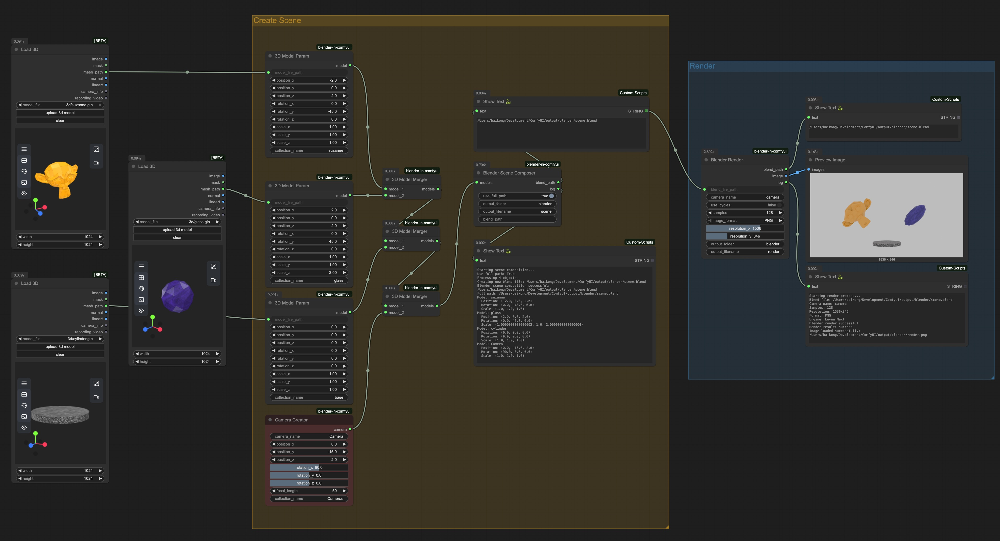

# Blender-in-ComfyUI

A comprehensive ComfyUI custom node collection for 3D model processing, scene composition, and Blender integration.

## Overview / 概述

This project provides a set of custom nodes for ComfyUI that enable seamless integration with Blender for 3D model loading, scene composition, and export workflows. It supports multiple 3D formats and provides intelligent transformation handling for different object types.

> 本项目为 ComfyUI 提供了一套自定义节点，实现与 Blender 的无缝集成，支持 3D 模型加载、场景合成和导出工作流。支持多种 3D 格式，并为不同类型的对象提供智能变换处理。



## Installation / 安装

### Prerequisites / 前置要求
- ComfyUI installed and running
- Blender 4.4+ installed
- Python 3.11+

### Important Note / 重要说明

**⚠️ ComfyUI Security Restriction / ComfyUI 安全限制**

This plugin uses `subprocess` to call Blender for 3D model processing. Due to ComfyUI's security restrictions on `subprocess` usage, there are two installation methods:

> 本插件使用 `subprocess` 调用 Blender 进行 3D 模型处理。由于 ComfyUI 对 `subprocess` 使用的安全限制，有两种安装方法：

#### Method 1: Manual Installation (Recommended) / 方法一：手动安装（推荐）

This is the most reliable method and is recommended for all users.

> 这是最可靠的方法，推荐所有用户使用。

#### Method 2: ComfyUI Manager Installation / 方法二：ComfyUI Manager 安装

If you want to use ComfyUI Manager for installation, you need to configure ComfyUI to allow `subprocess` usage:

> 如果你想使用 ComfyUI Manager 安装，需要配置 ComfyUI 允许 `subprocess` 使用：

1. **For ComfyUI with Manager / 使用 Manager 的 ComfyUI：**
   - Add `--allow-subprocess` flag when starting ComfyUI
   - Example: `python main.py --allow-subprocess`
   - 启动 ComfyUI 时添加 `--allow-subprocess` 参数
   - 示例：`python main.py --allow-subprocess`

2. **For ComfyUI Standalone / 独立版 ComfyUI：**
   - Modify ComfyUI's security settings to allow subprocess
   - 修改 ComfyUI 的安全设置以允许 subprocess

### Setup / 设置

#### Manual Installation / 手动安装

1. Clone this repository to your ComfyUI custom_nodes directory:

```bash
cd ComfyUI/custom_nodes
git clone https://github.com/JayLyu/blender-in-comfyui.git
```

2. Restart ComfyUI to load the new nodes

3. The nodes will appear in the "Blender" category in the node menu

#### ComfyUI Manager Installation / ComfyUI Manager 安装

1. Start ComfyUI with subprocess allowed:
```bash
python main.py --allow-subprocess
```

2. Use ComfyUI Manager to install the plugin

3. Restart ComfyUI to load the new nodes

## Configuration / 配置

### Blender Path Setup / Blender 路径设置

It is recommended to manually download Blender and extract it into the `blender` folder of this project to avoid unexpected errors from automatic downloads. Please select the appropriate version for your operating system:

>  建议手动下载 Blender 并解压到本项目的 `blender` 文件夹内，避免自动下载带来的不可预期错误。请根据你的操作系统选择对应版本下载：

- [Blender 4.4.3 for Windows](https://download.blender.org/release/Blender4.4/blender-4.4.3-windows-x64.zip)
- [Blender 4.4.3 for macOS](https://mirror.freedif.org/blender/release/Blender4.4/blender-4.4.3-macos-arm64.dmg)
- [Blender 4.4.3 for Linux](https://mirror.freedif.org/blender/release/Blender4.4/blender-4.4.3-linux-x64.tar.xz)

After downloading, extract Blender into the `blender` folder. For example:

> 下载后请将 Blender 解压到 `blender` 文件夹下。例如：

- Windows: `blender/blender-4.4.3-windows-x64/`
- macOS: `blender/Blender.app`
- Linux: `blender/blender-4.4.3-linux-x64/`

## Supported Formats / 支持的格式

### Input / 输入格式

- **GLB/GLTF**: glTF binary and text formats
- **FBX**: Autodesk FBX format
- **OBJ**: Wavefront OBJ format